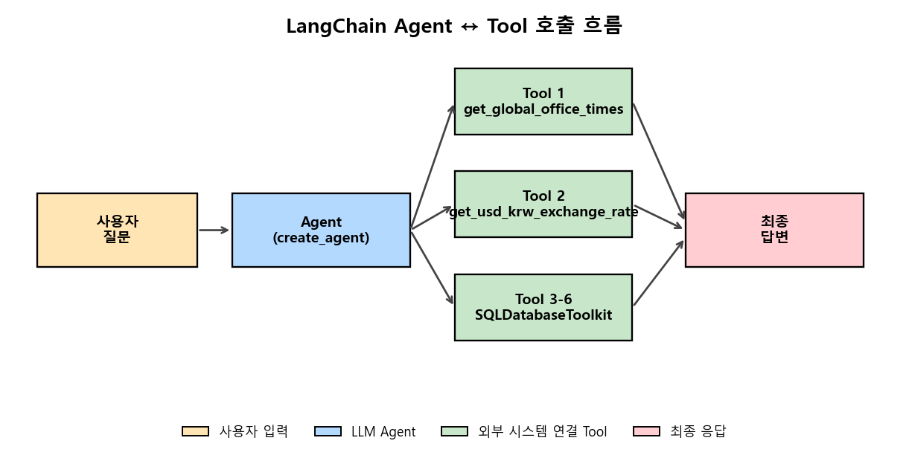
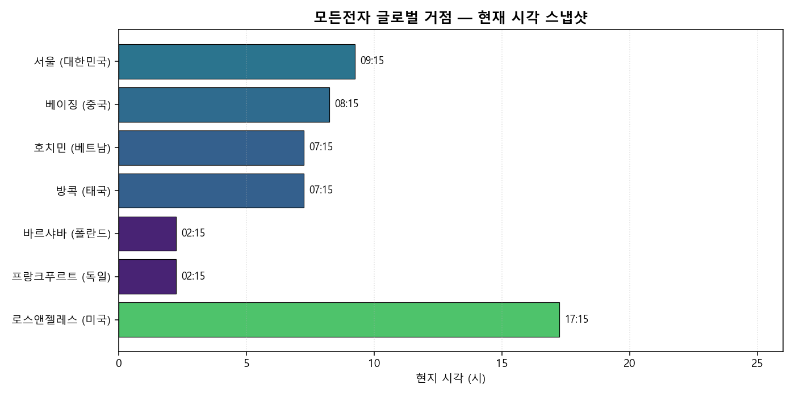
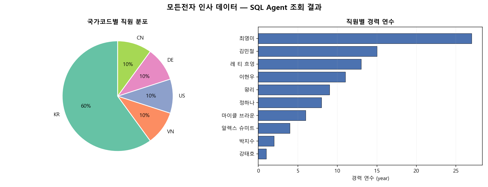

# 🤖 LangChain Agent & Tool Integration
### **커스텀 Tool · 웹 스크래핑 · SQL Toolkit** — LLM이 외부 시스템(웹·DB·OS)에 직접 접근하도록 만들어 본 LangChain Agent 통합 파이프라인


---

## 📌 프로젝트 요약 (Project Overview)

LLM(언어 모델)은 학습이 끝난 시점 이후의 정보를 알지 못합니다. 예를 들어 지금 이 순간의 환율이나 우리 회사 데이터베이스(DB) 안의 직원 명단 같은 것은 모델 혼자서는 절대 답할 수 없습니다. 처음 LangChain을 공부하면서 가장 인상 깊었던 점은, 이런 한계를 "더 똑똑한 모델"로 푸는 것이 아니라 LLM이 **직접 부를 수 있는 함수(Tool)** 를 옆에 두는 방식으로 푼다는 점이었습니다.

이 프로젝트는 그 아이디어를 직접 손으로 만져 보기 위해, 가상의 회사 "모든전자(Modeun Electronics)"의 사내 도우미 챗봇이라는 상황을 가정하고 LangChain Agent에 세 가지 종류의 함수를 연결해 본 기록입니다. 첫째는 해외 7개 도시의 현재 시각을 한꺼번에 알려 주는 시간 함수, 둘째는 네이버 증권 페이지에서 환율을 실시간으로 가져오는 함수, 셋째는 회사 직원 DB를 자연어 질문으로 조회하되 데이터를 바꾸는 명령(삭제·수정 등)은 절대 실행하지 않는 **읽기 전용 SQL 함수** 입니다. 단순히 코드를 짜는 데서 그치지 않고, **LLM이 어떤 함수를 언제 부르는지 / 어떻게 막아야 위험한 작업이 실행되지 않는지** 까지 직접 확인해 보는 것이 목표였습니다.

---

## 🎯 핵심 목표 (Motivation)

| 핵심 역량 | 상세 목표 |
| :--- | :--- |
| **함수(Tool) 만들기** | `@tool` 표시, 타입 힌트, 함수 설명(docstring)을 꼼꼼히 적어<br/>LLM이 "이 함수를 언제·어떻게 부르면 되는지" 스스로 판단할 수 있게 만들기 |
| **외부 데이터 연결** | 웹페이지에서 환율 가져오기(`requests` + `BeautifulSoup4`),<br/>도시별 시간대 계산(`zoneinfo`), SQLite로 직원 DB 흉내 내기 |
| **만들어진 툴킷 활용** | `SQLDatabaseToolkit`이 자동으로 만들어 주는 4개 함수<br/>(테이블 목록 보기 / 컬럼 보기 / 쿼리 확인 / 쿼리 실행)를 그대로 사용해<br/>자연어 질문을 SQL로 자동 변환 |
| **안전한 챗봇 만들기** | "삭제·수정 같은 위험한 명령은 실행하지 않는다"는 규칙을<br/>시스템 프롬프트에 적어 두어, 사용자가 위험한 요청을 해도 챗봇이 거절하도록 설계 |

---

## 📂 프로젝트 구조 (Project Structure)

```text
22. langchain-agent-tool-integration/
├─ data/
│  └─ modeun.db                              # SQLite 더미 DB (실행 시 자동 생성, gitignore 대상)
├─ results/
│  ├─ fig_01_global_office_clock.png         # 7개 해외 거점 현재 시각 시각화
│  ├─ fig_02_employee_distribution.png       # 국가별 직원 분포 + 경력 연수 막대 그래프
│  ├─ fig_03_pipeline_overview.png           # Agent ↔ Tool 호출 흐름 다이어그램
│  └─ agent_run_log.json                     # Agent 실행 로그 (질문·답변·사용 툴)
├─ src/
│  └─ agent_tool_pipeline.py                 # 통합 실행 스크립트 (mode 인자로 단계별 실행)
├─ .gitignore
├─ README.md
└─ requirements.txt
```

> **Note**: 프로젝트 루트에 `.env` 파일을 만들어 `BASE_URL`, `API_KEY` 두 개를 채워 넣어야 LLM 호출 모드가 동작합니다 (`--mode visualize` 만 단독 실행 시에는 불필요).

---

## 🏗️ Architecture & 핵심 구현 (Architecture & Core Implementation)

### 1. Agent ↔ Tool 호출 흐름

| LangChain Agent ↔ Tool 호출 흐름 (도식) |
| :---: |
|  |

> LLM 혼자서 답할 수 없는 질문이 들어오면, Agent는 등록된 함수 중에서 **함수 설명(docstring)과 타입 힌트**를 보고 적절한 함수를 골라 호출합니다. 그 결과를 받아 다시 사람이 읽기 좋은 문장으로 정리해서 답을 만들어 줍니다.

### 2. 등록한 함수(Tool) 요약

| 분류 | 함수 이름 | 핵심 동작 | 사용 라이브러리 |
| :---: | :--- | :--- | :---: |
| 시간 조회 | `get_global_office_times` | 해외 7개 도시의 현재 시각을<br/>한 번에 계산해서 반환 | `zoneinfo` |
| 웹페이지<br/>긁어오기 | `get_usd_krw_exchange_rate` | 네이버 증권 페이지의 환율 위치를<br/>찾아 텍스트로 추출 | `requests`<br/>`BeautifulSoup4` |
| SQL 툴킷 | `sql_db_list_tables` | DB 안에 어떤 테이블이 있는지<br/>목록 반환 | `SQLDatabaseToolkit` |
| SQL 툴킷 | `sql_db_schema` | 테이블의 컬럼 구조와 샘플 3줄을<br/>LLM에 보여줌 | `SQLDatabaseToolkit` |
| SQL 툴킷 | `sql_db_query_checker` | 실행 전 SQL 문법이 맞는지<br/>한 번 더 검사 | `SQLDatabaseToolkit` |
| SQL 툴킷 | `sql_db_query` | 검사를 통과한 쿼리를<br/>실제로 실행 | `SQLDatabaseToolkit` |

### 3. 핵심 설계 포인트

| 설계 포인트 | 적용 방법 | 효과 |
| :--- | :--- | :--- |
| **함수 설명이 곧<br/>LLM 사용 설명서** | `@tool` 함수의 docstring에<br/>**언제·어떻게 부르는지**를 풀어서 적음 | LLM은 함수 안의 코드를 읽지 않고,<br/>설명문과 타입 힌트만 보고 호출을 결정함 |
| **DB 종류를<br/>자동으로 알려 주기** | 시스템 프롬프트에 `db.dialect`(예: `sqlite`)<br/>값을 직접 끼워 넣음 | 나중에 같은 코드로 MySQL이나 PostgreSQL을 써도<br/>LLM이 알아서 올바른 SQL을 만들어 줌 |
| **결과 개수 제한** | "결과는 최대 5건까지만 가져온다"고<br/>시스템 프롬프트에 명시 | 한 번에 수천 줄이 쏟아져 들어와<br/>답변 비용이 크게 늘어나는 상황을 미리 막음 |
| **읽기 전용 규칙** | "삭제·수정·생성 같은 변경 명령은<br/>실행하지 않고 정중히 거절한다"는 규칙을<br/>시스템 프롬프트에 못 박음 | 사용자가 위험한 요청을 해도<br/>LLM이 SQL 함수를 부르기 전에<br/>알아서 거절 |
| **외부 사이트<br/>오류 대응** | 웹페이지 요청 함수에<br/>5초 타임아웃과 `try/except`를 적용 | 네이버 증권 같은 외부 사이트가<br/>점검·장애일 때도 챗봇 전체가 멈추지 않고<br/>친절한 메시지로 답변 |

### 4. 실행 방법

| 명령어 | 동작 | LLM 호출 |
| :--- | :--- | :---: |
| `python src/agent_tool_pipeline.py --mode times` | 7개 도시 시간 챗봇 시연 | ✓ |
| `python src/agent_tool_pipeline.py --mode exchange` | 실시간 환율 챗봇 시연 | ✓ |
| `python src/agent_tool_pipeline.py --mode sql` | 읽기 전용 SQL 챗봇 시연 (질문 3개 실행) | ✓ |
| `python src/agent_tool_pipeline.py --mode visualize` | 시각화 PNG 3장 만들기 | ✗ |
| `python src/agent_tool_pipeline.py --mode all` | 위 단계 전부 한 번에 실행 | ✓ |

---

## 📊 시각화 결과 (Results)

### 1. 해외 거점 현재 시각 스냅샷



| 항목 | 내용 |
| :--- | :--- |
| **구성** | 7개 도시(서울·베이징·호치민·방콕·바르샤바·프랑크푸르트·LA)의 현재 시각을 가로 막대와 텍스트로 표시 |
| **확인 포인트** | 막대 색이 시간대에 따라 새벽(보라색) → 오전(파랑) → 오후(초록) 순으로 자연스럽게 변함 |
| **의미** | `get_global_office_times` 함수 한 번 호출로 받아온 7개 도시 데이터를 그대로 그림으로 옮긴 결과 — 챗봇이 보는 데이터와 그래프가 1:1로 대응됨 |

### 2. SQL 챗봇 조회 결과 — 직원 데이터



| 항목 | 내용 |
| :--- | :--- |
| **구성** | 왼쪽: 국가별 직원 분포(파이 차트, 한국 60% / 나머지 4개국 각 10%), 오른쪽: 직원 10명의 경력 연수(가로 막대) |
| **확인 포인트** | 최영미 부장(27년) → 김민철 차장(15년) 순으로 오래된 직원 분포가 보임 |
| **의미** | "가장 먼저 입사한 사람"이라는 자연어 질문에 챗봇이 내놓은 답(최영미 부장, 1998-05-20)이 그래프 맨 위와 정확히 일치함을 그림으로 검증 |

---

## ✨ 주요 결과 및 분석 (Key Findings & Analysis)

| 발견한 사실 | 관찰 내용과 적용 방법 |
| :--- | :--- |
| **함수 설명이 곧 LLM 사용 설명서** | docstring을 비워 둔 채 등록하니 "지금 몇 시야?" 질문에도 LLM이 함수를 부르지 않았음. 사용 안내 한 줄을 추가하자 즉시 정확히 호출함. → LLM은 함수 코드를 읽지 않고 **이름·타입 힌트·설명문**만 본다. 이 세 가지를 "LLM이 읽을 사용 설명서"로 보고 꼼꼼히 적어야 함 |
| **SQL 툴킷의 4단계 사고 흐름** | `테이블 목록 → 컬럼 보기 → 쿼리 검사 → 쿼리 실행` 4단계를 거치게 하면 LLM이 DB 구조를 전혀 모르는 상태에서도 안전하게 정답에 도달함. → 사람 개발자가 처음 보는 DB를 다루는 절차와 거의 동일. 함수를 모아 두는 게 아니라 **"절차" 자체를 함수로 풀어 둔 설계** 가 인상적 |
| **시스템 프롬프트가 첫 번째 안전장치** | "삭제·수정 명령은 실행하지 않는다" 한 줄만 넣어 두었더니, "박지수 대리를 삭제해줘" 요청에 LLM이 SQL 함수를 부르지 않고 정중히 거절함. → 시스템 프롬프트는 챗봇의 행동 규칙. 다만 **첫 번째 방어선** 일 뿐이고, 실제 서비스라면 DB 계정 자체를 "읽기만 가능"으로 만드는 게 정석 |
| **외부 사이트 연결은 평범한 코딩 기본기** | 환율 함수는 네이버 증권 페이지 구조가 바뀌면 즉시 깨짐. 5초 타임아웃과 `try/except`로 친절한 실패 메시지를 돌려주자 답변이 훨씬 안정적이 됨. → LLM이 아무리 똑똑해도 함수가 깨지면 챗봇 전체가 멈춤. **타임아웃·예외 처리·명확한 실패 메시지** 같은 코딩 기본기가 AI 시스템에서도 그대로 중요 |

---

## 💡 회고록 (Retrospective)

이 프로젝트를 시작하기 전까지 저에게 LLM은 그저 "말을 잘하는 상자" 정도였습니다. 질문을 던지면 그럴듯한 답이 돌아오긴 하지만, 정작 "지금 환율이 얼마야?", "우리 회사 직원 중에 가장 오래 일한 사람이 누구야?" 같은 현실적인 질문 앞에서는 한 발도 나아가지 못하는 게 분명했습니다. LangChain에서 Tool이라는 개념을 처음 봤을 때 무척 새로웠던 점은, 이 한계를 "더 큰 모델"로 푸는 게 아니라 모델 옆에 부를 수 있는 함수를 두는 식으로 푼다는 것이었습니다. 모델을 키우는 게 아니라, 모델에게 손과 발을 달아 주는 접근이라는 표현이 가장 잘 어울렸습니다.

직접 함수를 만들어 붙여 보면서 가장 의외였던 부분은 함수 설명(docstring)이었습니다. 평소에 저는 docstring을 "다른 개발자가 읽으라고 적어 두는 메모" 정도로만 여겨 왔습니다. 그런데 LangChain에서는 LLM이 그 설명문을 읽고 "지금 이 함수를 부를지 말지"를 판단합니다. 처음 7개 도시 시간 함수를 만들었을 때 설명을 너무 짧게 적어 두었더니, "지금 몇 시야?"라는 질문에도 LLM이 함수를 부르지 않고 "실시간 시간은 알 수 없다"고만 답하는 일이 생겼습니다. 설명문에 "사용자가 시간을 물으면 이 함수를 사용한다"는 한 문장을 넣자 그 즉시 함수를 정확히 부르기 시작했습니다. 그때부터 함수 이름, 타입 힌트, 설명문을 한 묶음의 "LLM용 사용 설명서"로 보기 시작했고, 함수를 만들 때마다 더 신경 써서 적게 되었습니다.

웹페이지에서 환율을 가져오는 함수를 만들면서도 비슷한 경험을 했습니다. 네이버 증권 페이지의 환율 위치는 페이지 개편이 있을 때마다 살짝씩 바뀌는데, 이런 외부 사이트에 의존하는 구조는 함수가 갑자기 멈출 위험을 늘 안고 있습니다. LLM이 아무리 똑똑해도 함수 한 개가 깨지면 챗봇 전체가 답을 못 내놓는 상황이 됩니다. 그래서 환율 함수에는 5초 타임아웃을 걸고, 실패했을 때는 사람이 읽기 좋은 메시지를 돌려주도록 했습니다. 이 작은 처리 하나로 챗봇의 답변이 훨씬 안정적으로 바뀌는 걸 보면서, AI 시스템이라고 해도 결국 평범한 코딩 기본기 — 타임아웃, 예외 처리, 친절한 실패 메시지 — 가 그대로 결정적이라는 걸 다시 느꼈습니다.

가장 인상 깊었던 부분은 SQL 챗봇을 만들면서 "시스템 프롬프트가 챗봇의 행동 규칙이 될 수 있다"는 점을 직접 본 순간이었습니다. "박지수 대리를 DB에서 삭제해줘" 같은 위험한 요청이 들어왔을 때, 따로 차단 코드를 짜지 않고 시스템 프롬프트에 "삭제·수정 명령은 실행하지 않고 정중히 거절한다"는 한 줄을 적어 두었더니, LLM이 정말로 SQL 함수를 부르지 않고 정중히 거절하는 답을 내놓았습니다. 물론 이게 완벽한 안전장치라고 생각하지는 않습니다. 실제 서비스라면 DB 계정 자체를 "읽기만 가능"으로 만드는 게 정석이겠지만, 그 앞에 "시스템 프롬프트라는 첫 번째 방어선"을 둘 수 있다는 것을 직접 확인한 경험은 컸습니다.

또 한 가지 의외였던 부분은 `SQLDatabaseToolkit`이 자동으로 만들어 주는 네 개의 함수(`list_tables`, `schema`, `query_checker`, `query`)가 마치 한 사람의 생각 흐름처럼 자연스럽게 이어진다는 점이었습니다. LLM은 DB 구조를 전혀 모르는 상태에서 시작합니다. 그런데 먼저 어떤 테이블이 있는지 묻고, 그 다음 그 테이블의 컬럼을 보고, 그 다음 쿼리를 짜서 검사한 뒤, 마지막에 실행합니다. 사람 개발자가 처음 보는 DB에 접근할 때 거치는 순서와 거의 똑같습니다. 단순히 함수 네 개를 묶어 놓은 게 아니라 "처음 보는 DB를 안전하게 만나는 절차" 자체를 함수로 풀어 둔 설계라는 점이 인상 깊었습니다.

이번 프로젝트를 통해 LLM은 외부 시스템과 연결될 때 비로소 진짜 도구가 된다는 것을 직접 느꼈습니다. 그리고 그 연결을 만드는 일에서, 화려한 AI 기술보다는 평범한 코딩 기본기 — 타입 힌트, 함수 설명문, 예외 처리, 결과 개수 제한 — 가 더 큰 무게를 가진다는 것도 알게 됐습니다. 다음 단계에서는 단순히 함수 하나를 더 붙이는 방향이 아니라, 회사 내부 문서까지 검색해서 답할 수 있는 RAG(검색 기반 답변) 챗봇이나, 여러 챗봇이 서로 협력해서 하나의 일을 처리하는 구조까지 도전해 보고 싶습니다. 이번에 손에 익힌 함수 설계 감각이, 앞으로 더 복잡한 챗봇을 만들 때도 단단한 기반이 되어 줄 것이라고 믿습니다.

---

## 🔗 참고 자료 (References)

- LangChain Documentation — `create_agent` / `@tool` Decorator (LangChain AI, 2024)
- LangChain Community — `SQLDatabaseToolkit` API Reference
- BeautifulSoup4 — HTML Parser for Python (Crummy, 2024)
- Naver Finance Market Index Page — Real-time Exchange Rate (`finance.naver.com/marketindex`)
- NVIDIA AI ACADEMY · 챗봇 프로젝트 — `chapter_02_agent_tool` / `chapter_03_sql_agent`
